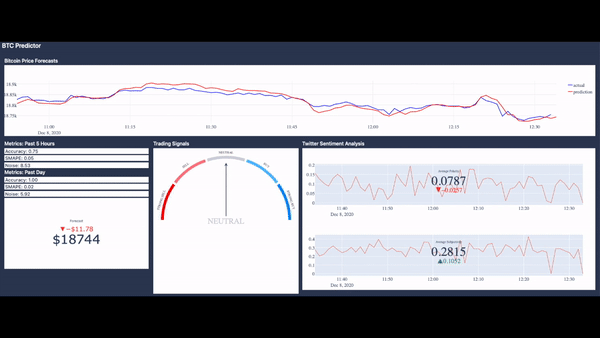

# BTC Predictor

BTC predictor is a dashboard powered by machine learning algorithms that helps Bitcoin investors make more reliable investment decisions. It was designed by the Anchain.ai Bitcoin Price Prediction team from UC Berkeley's Data-X course.

## Organization and Documentation

### Folder Hierarchy

- **heroku-script**: contains the code for our 24/7 data collector
    - **script.py**: contains the code that schedules when the data should be collected and stored in our Firebase database
    - **util**: contains the code for each data collector, or logger for short, and any additional helper code
        - **database.py**: establishes a connection to our Firebase database
        - **helpers.py**: contains several helper methods for scheduling and timing
        - **logger.py**: contains an abstract class that has two static methods: `log` and `store`. Every logger inherits from this class
        - **news_logger.py**: contains a python class for logging news data from [IEXCloud](https://iexcloud.io/) every 5 minutes. This data is stored in Firebase at the end of each day
        - **reporter.py**: contains a class for sending emails. Each email contains a report that summarizes the data collected for the past day. The reporter also sends an email whenever an error occurs during data collection
        - **tckr_logger.py**: contains a class for logging 5 second Bitcoin exchange data. This data is stored in Firebase at the end of each day
        - **trxn_logger.py**: contains a class for logging Bitcoin transaction data. This data is stored in Firebase at the end of each day

- **predictor**: contains the machine learning models and dashboard for the project
    - **datastore**: contains several files that interact with the data collected from our 3rd party API’s
        - **archives.py**: contains a class with methods that retrieve data from long-term Firebase database
        - **btcstock.py**: contains a class that provides easier access to minute-by-minute OHLCV Bitcoin data from [Bitstamp](https://www.bitstamp.net)
        - **datastore.py**: a class composed of all other modules in this folder
        - **realtime.py**: contains a class with methods that retrieve data from our realtime Firebase database
        - **tweety.py**: contains a class with several methods that allow for fast tweet scraping using [twint](https://github.com/twintproject/twint)
    - **models**: contains 3 different LSTM models each of which can make minutely Bitcoin price predcitions
        - **baseline.py**: uses the past price as the only feature
        - **indicator.py**: uses technical indicators computed from open-high-low-close-volume (OHLCV) data as features
        - **oracle.py**: uses technical indicators and twitter sentiment scores as features
    - **sti**: contains a module for stock technical indicator (STI) computations
        - **sti.py**: a wrapper class for computing various stock technical indicators from OHLCV data
    - **BaselineDemo.ipynb**: this Ipython notebook walks you through the baseline.py class
    - **IndicatorDemo.ipynb**: this Ipython notebook walks you through the indicator.py class
    - **OracleDemo.ipynb**: this Ipython notebook walks you through the oracle.py class
    - **Dashboard.ipynb**: this Ipython notebook consists of the code for the actual dashboard
    - **RealTimeTradingSignalDemo.ipynb**: this Ipython notebook walks you through the code for the trading strategy aspect of the dashboard
    
## Technical Sophistication and Efficiency

### System Architecture

### Key Features
1. BTC predictor is powered by an LSTM model, which is well-known for its high performance in sequence prediction tasks. Why not use some other time series model? In the [research](https://arxiv.org/ftp/arxiv/papers/2006/2006.14473.pdf) we reviewed, we found that the LSTM model offers better Bitcoin exchange rate forecasts than the ARIMA model. Furthermore, the LSTM model offers a lot more flexibility than the prophet model, making it ideal for this particular task.
  
2. For backtesting, we collected over 2+ years worth of tweets using our datastore's tweet scraper. Under the hood, it uses multiprocessing and multithreading to help reduce the effect of Python's GIL and achieve faster collection times. With the scraper, we managed to reduce tweet collection time from several days to ~20 minutes.
  
3. BTC predictor is capable of collecting tweets *every minute* from [twint](https://github.com/twintproject/twint) thanks to its tweet cache. The tweet cache abstracts away all the intricacies of working with twint allowing for faster access to tweets.
  
4. BTC predictor will cache computations within each minute to prevent any repeated work. This allows you to get the results you need as fast as possible.
  
5. BTC predictor's underlying model is retrained on fresh data every 5 - 10 minutes. Frequent retraining allows the model to constantly learn emerging market trends and sentiments. This in turn ensures that predictions do not degrade over time and gives the model the ability to anticipate shocks to the market. Thanks to our multithreaded training scheme, model retraining does not interrupt dashboard predictions, so the end user will always see a constant stream of predictions every minute.

## Reproducibility

### Package Requirements ###
- tensorflow==2.3.1
- sklearn==0.23.2
- plotly==4.9.0
- pyrebase==3.0.27
- pandas==1.0.1
- ta==0.7.0
- fbprophet==0.7.1
- textblob==0.15.3
- twint==2.1.21
- requests==2.11.1
- numpy==1.18.5
- jupyter_dash==0.3.1
- dash_bootstrap_components==0.10.7
- dash_core_components==1.14.1
- dash_html_components==1.1.1
- dash==1.18.1

### How to Run: Demos ### 
1. Download required packages
2. Open the demo of your choosing in a Jupyter Notebook (NOT Google Colab)
    - Note: OracleDemo.ipynb may show warnings due to our twint dependency and takes a long time to warm up. It is recommended to start with IndicatorDemo.ipynb first.
3. Run the cells in order and please follow the comments!

### How to Run: Dashboard ### 
1. Download required packages
2. Open dashboard.ipynb in a Jupyter Notebook (NOT Google Colab)
    - Note: OracleDemo.ipynb may show warnings due to our twint dependency and takes a long time to warm up.
3. Run the cells in order up until “Example Usage”
4. Run the following cell 
5. Run the cell below with `predictor.has_model()` until the output is True
6. Run the remaining cells in the notebook
7. Click the link to the external Dash application

## About the Team

- We are a team of UC Berkeley students from various backgrounds and majors 
- **Chris De Leon**
    - Major: Computer Science
    - About: Has past research and internship experience in Machine Learning and AI
    - Project Responsibilities: Creating and implementing various aspects of the backend model 
- **Michela Burns** 
    - Major: Data Science
    - About: Has past project and internship experience in Machine Learning and Data Analytics
    - Project Responsibilities: Twitter web scraping and real-time dashboard
- **Vivian Lin** 
    - Major: Data Science and Economics 
    - About: Has a background in behavioral economics, finance, and three years of stock trading experience on the side
    - Project Responsibilities: Creating and implementing the trading strategies

